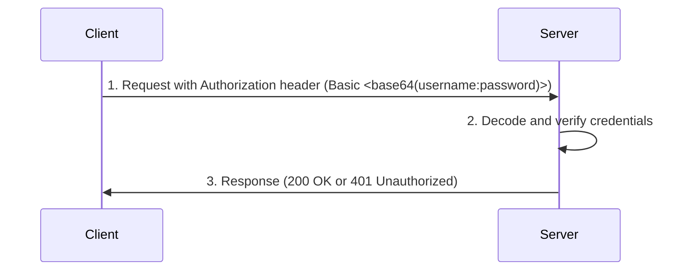
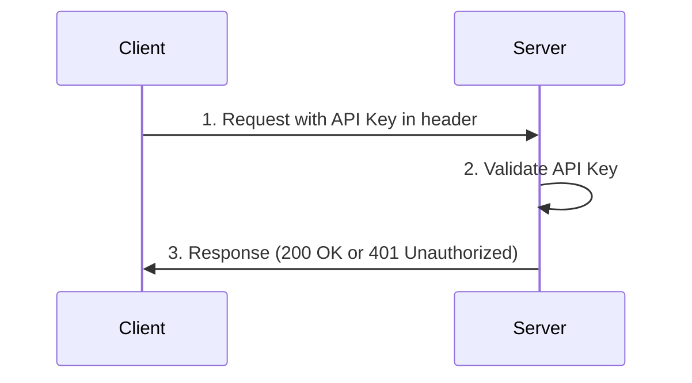

# api-auth-methods

Learning how different authentication methods work with FastAPI.

## Index

TODO

## HTTP basic authentication

### Overview

HTTP Basic Authentication is the most rudimentary authentication method available for APIs.
It involves sending the username and password in the `Authorization` header of the HTTP request.
The credentials are encoded using Base64, but they are not hashed or encrypted.
Unless used in conjunction with HTTPS, this is an insecure authentication mechanism.

### Example Flow

1. **Client Request**: The client sends a request with an `Authorization` header in the format `Basic <base64(username:password)>`.
2. **Server Verification**: The server decodes the credentials and verifies them.
3. **Access Granted/Denied**: Based on verification, the server either grants access or responds with an error.

## API Key Authentication

### Overview

API Key Authentication is a simple method where a client includes a unique key in the request headers.
This key is often assigned during account creation or API registration and is used by the server to identify and authenticate the client.
Unlike username and password combinations, API keys are typically used for authenticating machines and services.

API keys should be kept confidential, as anyone with the key can access the API as the authenticated user.

### Example Flow

1. **Client Request**: The client sends a request with the header `X-API-Key: <api_key>`.
2. **Server Verification**: The server validates the provided API key by comparing it to the expected key.
3. **Access Granted/Denied**: If the API key matches, access is granted. Otherwise, the server responds with an error.

