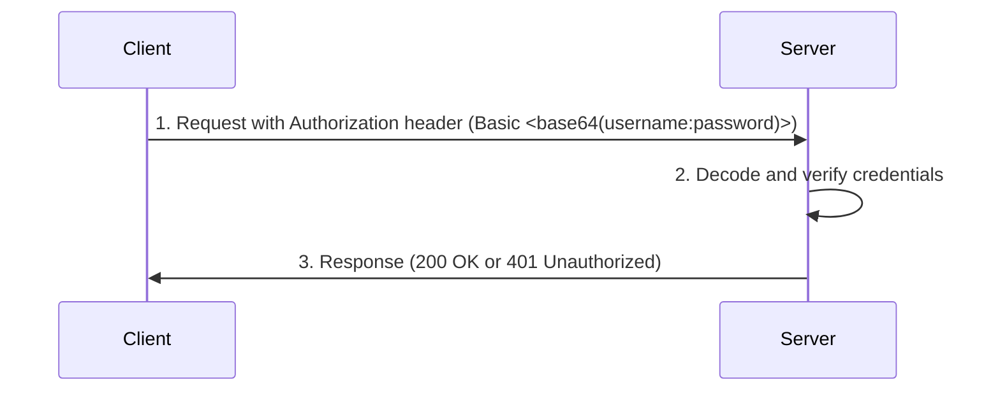
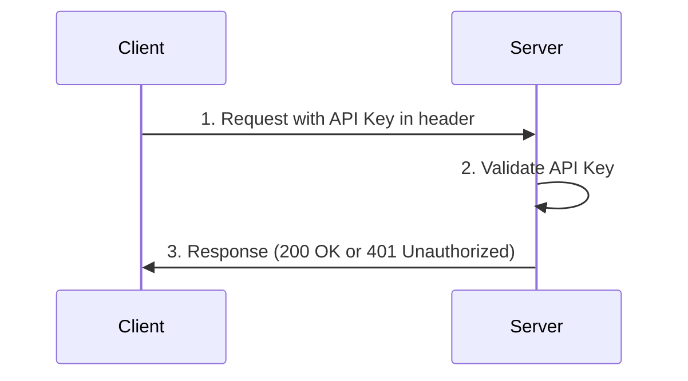

# api-auth-methods

Learning how different authentication methods work with FastAPI.

## Index

TODO

## HTTP basic authentication

### Overview

HTTP Basic Authentication is the most rudimentary authentication method available for APIs.
It involves sending the username and password in the `Authorization` header of the HTTP request.
The credentials are encoded using Base64, but they are not hashed or encrypted.
Unless used in conjunction with HTTPS, this is an insecure authentication mechanism.

### Example Flow

1. **Client Request**: The client sends a request with an `Authorization` header in the format `Basic <base64(username:password)>`.
2. **Server Verification**: The server decodes the credentials and verifies them.
3. **Access Granted/Denied**: Based on verification, the server either grants access or responds with an error.

## API Key Authentication

### Overview

API Key Authentication requires the client to send an API Key via a custom header.

### Example Flow

Client Request: The client sends a request with the header `X-API-Key: <api_key>`.
Server Verification: The server checks if the API Key is valid.
Access Granted/Denied: Based on verification, access is granted or denied.

