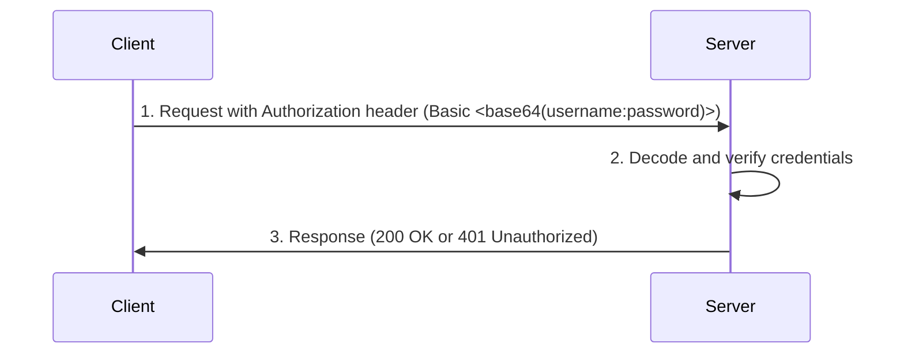
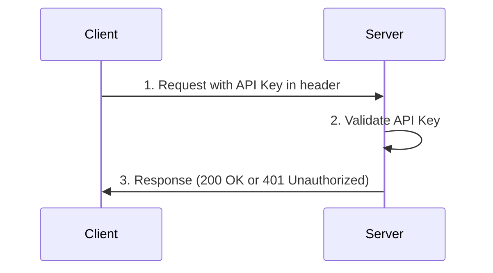
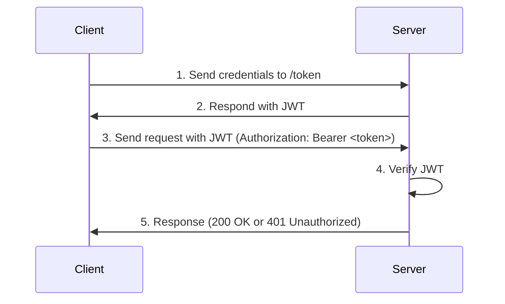

# api-auth-methods

Learning how different authentication methods work with FastAPI.

## Index

TODO

## HTTP basic authentication

### Overview

HTTP Basic Authentication is the most rudimentary authentication method available for APIs.
It involves sending the username and password in the `Authorization` header of the HTTP request.
The credentials are encoded using Base64, but they are not hashed or encrypted.
Unless used in conjunction with HTTPS, this is an insecure authentication mechanism.

### Example Flow

1. **Client Request**: The client sends a request with an `Authorization` header in the format `Basic <base64(username:password)>`.
2. **Server Verification**: The server decodes the credentials and verifies them.
3. **Access Granted/Denied**: Based on verification, the server either grants access or responds with an error.

## API Key Authentication

### Overview

API Key Authentication is a simple method where a client includes a unique key in the request headers.
This key is often assigned during account creation or API registration and is used by the server to identify and authenticate the client.
Unlike username and password combinations, API keys are typically used for authenticating machines and services.

API keys should be kept confidential, as anyone with the key can access the API as the authenticated user.

### Example Flow

1. **Client Request**: The client sends a request with the header `X-API-Key: <api_key>`.
2. **Server Verification**: The server validates the provided API key by comparing it to the expected key.
3. **Access Granted/Denied**: If the API key matches, access is granted. Otherwise, the server responds with an error.

## JWT Authentication

### Overview

JWT (JSON Web Token) Authentication is a token-based stateless authentication method commonly used in modern APIs.
Instead of using session IDs or cookies, the client receives a JWT from the server after successfully logging in.
The client includes this token in every subsequent request, allowing the server to verify the client's identity without needing to keep track of session data.

A JWT is a compact, URL-safe token that contains a set of claims, such as user identity and expiration time.
It is signed by the server using a secret key, allowing the server to validate the token's authenticity.

### Example Flow

1. **Client Login**: The client sends a request with credentials (e.g., username and password) to a `/token` endpoint.
2. **Server Response**: If the credentials are correct, the server generates a JWT and sends it back to the client.
3. **Client Request**: The client includes the JWT in the Authorization header (in the format `Bearer <token>`) in subsequent requests.
4. **Server Verification**: The server verifies the token’s signature, extracts the claims, and processes the request based on the token’s validity.
5. **Access Granted/Denied**: If the the validation is successful, access is granted. Otherwise, the server responds with an error.

